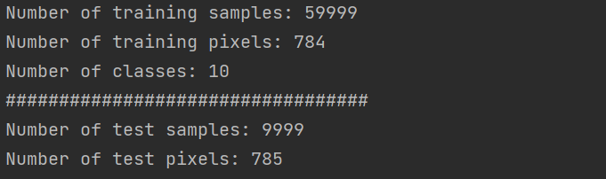
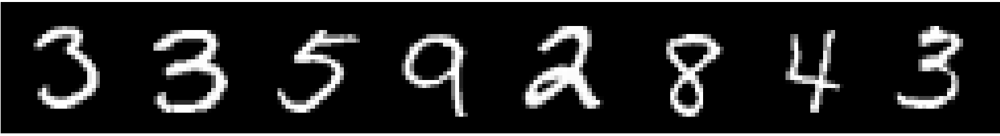
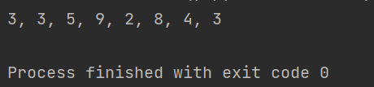
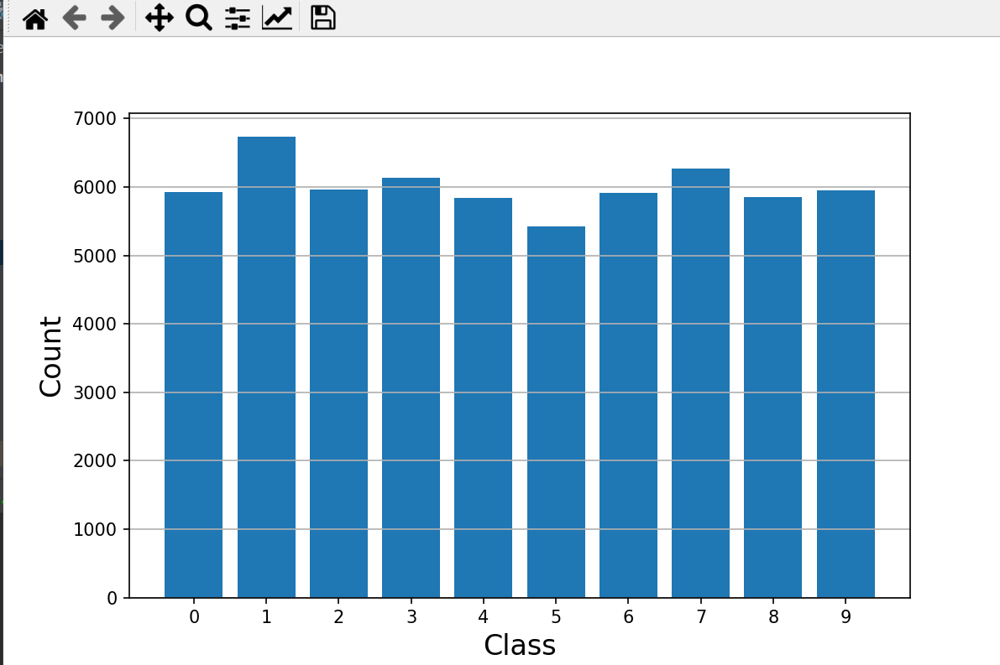

# 构建一个神经网络+对MNIST数据集进行可视化分析

## 1.定义一个神经网络并保存
```python

import torch.nn as nn
from collections import OrderedDict
import torch
##################################################################################
#define a network
class MyNet(nn.Module):
    def __init__(self):
        super(MyNet, self).__init__()
        self.conv1=nn.Conv2d(in_channels=3,out_channels=64,kernel_size=3)
        self.conv2=nn.Conv2d(64,64,3)

        self.maxpool1=nn.MaxPool2d(2,2)
        self.features=nn.Sequential(OrderedDict(
            [
                ('conv3',nn.Conv2d(64,128,3)),
                ('conv4',nn.Conv2d(128,128,3)),
                ('relu1',nn.ReLU())
            ]
        ))
    def forward(self,x):
        x=self.conv1(x)
        x=self.conv2(x)
        x=self.maxpool1(x)
        x=self.features(x)
        return x
##################################################################################
# SGD optimizer
net=MyNet()
# define optimizer---for train
optimizer=torch.optim.SGD(net.parameters(),  # net.parameters() is important
                          lr=0.001,  #Learning rate
                          momentum=0.9
                          )
#构建一个词典
state={'net':net.state_dict(),'optimizer':optimizer.state_dict()}
torch.save(state,'./model/MyNet.pth')                  # save the model

# Test
print(net)

for idx,m in enumerate(net.modules()): #data-size
    print(idx,"-",m)
print('##################################################')
for p in net.parameters():
    print(type(p.data),p.size())


```
## 2.下载MNIST数据集,将训练集和测试集转换为.csv格式，并保存在./model目录下
```python
import torch
import torchvision
import torch.utils.data as Data
import scipy.misc
import os
import matplotlib.pyplot as plt
#将MNIST数据集转换为csv格式
mydataset = torchvision.datasets.MNIST(root='./dataset',
                                      train=True,
                                      transform=None,
                                      target_transform=None,
                                      download=True)
def convert(imgf, labelf, outf, n):
    f = open(imgf, "rb")
    o = open(outf, "w")
    l = open(labelf, "rb")

    f.read(16)
    l.read(8)
    images = []

    for i in range(n):
        image = [ord(l.read(1))]
        for j in range(28 * 28):
            image.append(ord(f.read(1)))
        images.append(image)

    for image in images:
        o.write(",".join(str(pix) for pix in image) + "\n")
    f.close()
    o.close()
    l.close()

convert("./dataset/MNIST/raw/train-images-idx3-ubyte", "./dataset/MNIST/raw/train-labels-idx1-ubyte",
        "./dataset/mnist_train.csv", 60000)
convert("./dataset/MNIST/raw/t10k-images-idx3-ubyte", "./dataset/MNIST/raw/t10k-labels-idx1-ubyte",
        "./dataset/mnist_test.csv", 10000)
print("Convert Finished!")
```

## 3.MNIST数据集可视化
### 3.1 数据概况
```python
# EDA:一般在进行模型训练之前，都要做一个数据集分析的任务
import pandas as pd
import torch
from torchvision.utils import make_grid
import matplotlib.pyplot as plt
train_df = pd.read_csv('./dataset/mnist_train.csv')
n_train = len(train_df)
n_pixels = len(train_df.columns) - 1 #有多少列，就是多少个像素（28*28=784）
label = train_df.iloc[0:60000,0]
n_class = len(set(label))#set删除重复项后，就是类别数
print('Number of training samples: {0}'.format(n_train))
print('Number of training pixels: {0}'.format(n_pixels))
print('Number of classes: {0}'.format(n_class))
print('##################################')
# 读取测试集
test_df = pd.read_csv('./dataset/mnist_test.csv')
n_test = len(test_df)
n_pixels = len(test_df.columns)
print('Number of test samples: {0}'.format(n_test))
print('Number of test pixels: {0}'.format(n_pixels))
```


----
### 3.2 数据可视化
```python
# 数据可视化
import pandas as pd
import torch
from torchvision.utils import make_grid
import matplotlib.pyplot as plt
import numpy as np
from torchvision.utils import make_grid
import torch
import matplotlib.pyplot as plt
train_df = pd.read_csv('./dataset/mnist_train.csv')
n_train = len(train_df)
n_pixels = len(train_df.columns) - 1 #有多少列，就是多少个像素（28*28=784）
label = train_df.iloc[0:60000,0]
n_class = len(set(label))#set删除重复项后，就是类别数
# 读取测试集
test_df = pd.read_csv('./dataset/mnist_test.csv')
n_test = len(test_df)
n_pixels = len(test_df.columns)
############################
random_sel = np.random.randint(len(train_df), size=8)#从0-len(train_df),随机取八个
data = (train_df.iloc[random_sel,1:].values.reshape(-1,1,28,28)/255.)#iloc索引行,随机取八行，然后取数据（第0行是label所以不取）
grid = make_grid(torch.Tensor(data), nrow=8)#把8个图片拼到一起
plt.rcParams['figure.figsize'] = (16, 2)
plt.imshow(grid.numpy().transpose((1,2,0)))#把第0维channel数换到第三维
plt.axis('off')
plt.show()
print(*list(train_df.iloc[random_sel, 0].values), sep = ', ')
```



### 3.3 判别类别是否均衡

```python
import pandas as pd
import torch
from torchvision.utils import make_grid
import matplotlib.pyplot as plt
import numpy as np
from torchvision.utils import make_grid
import torch
import matplotlib.pyplot as plt
train_df = pd.read_csv('./dataset/mnist_train.csv')
n_train = len(train_df)
n_pixels = len(train_df.columns) - 1 #有多少列，就是多少个像素（28*28=784）
label = train_df.iloc[0:60000,0]
n_class = len(set(label))#set删除重复项后，就是类别数
# 读取测试集
test_df = pd.read_csv('./dataset/mnist_test.csv')
n_test = len(test_df)
n_pixels = len(test_df.columns)
############################
# 检查类别是否不均衡
plt.figure(figsize=(8,5))
plt.bar(label.value_counts().index, label.value_counts())
plt.xticks(np.arange(n_class))
plt.xlabel('Class', fontsize=16)
plt.ylabel('Count', fontsize=16)
plt.grid('on', axis='y')
plt.show()
```


